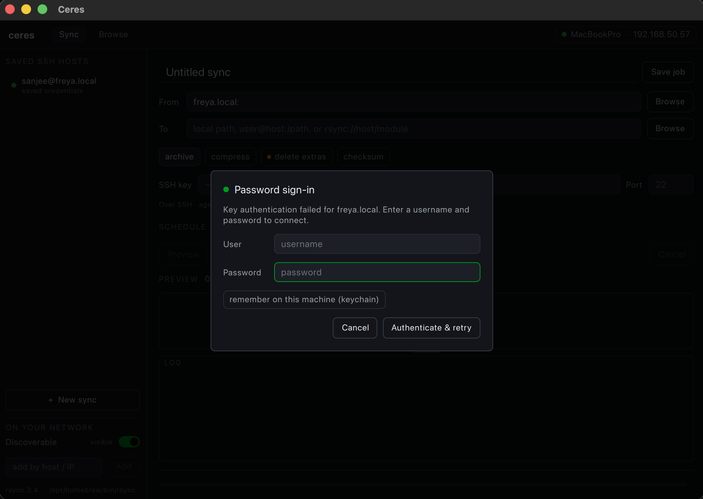
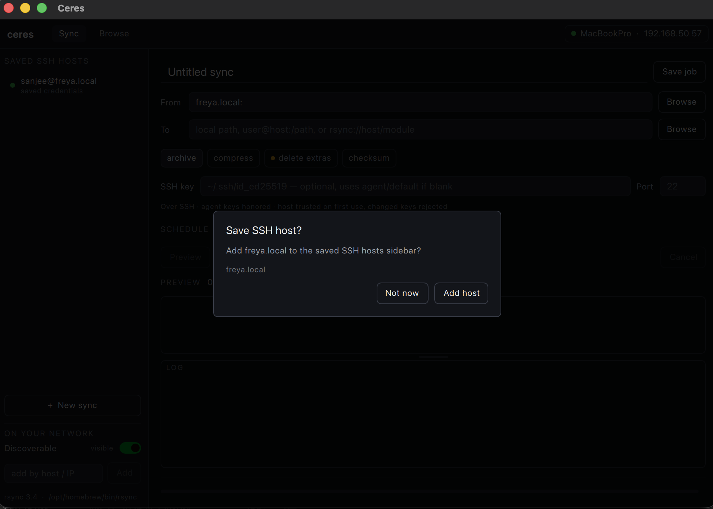
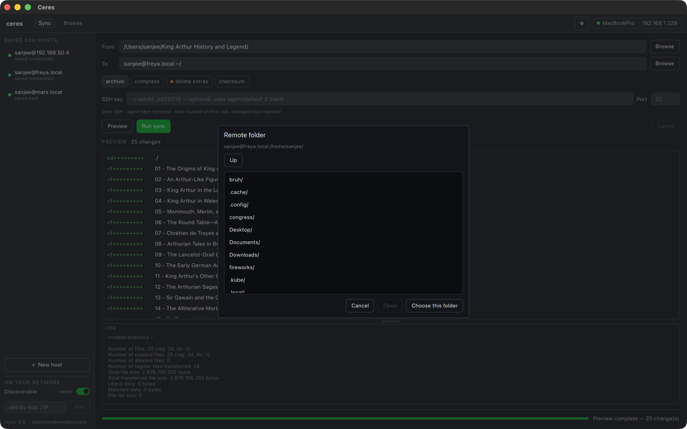

# Ceres

A sleek, cross-platform GUI for **rsync**, built with native C++ / Qt 6 (Qt Quick).

It wraps the real `rsync` binary (not librsync) so it speaks the genuine rsync wire
protocol — local, SSH (`user@host:`), and daemon (`rsync://`) targets all work. The aim
is a calm, opinionated front-end with a real **before-you-sync preview**, first-class live
progress, and safe defaults — over an advanced tier for full flag control later.

> **Status: prototype.** Boots a QML window, previews and runs ad-hoc rsync syncs
> through `QProcess`, browses local/remote files, and streams parsed
> `--itemize-changes` output into the UI.

## Screens

The modal dialogs across the Sync and Browse tabs:

| | |
| --- | --- |
| **SSH password** — prompts for credentials when key auth fails (sync runs and browse connects share it). |  |
| **Add SSH host** — offered when you use a host that isn't saved yet. |  |
| **Delete-extras confirm** — the destructive-run safety gate before a `--delete` sync. |  |
| **Remote folder picker** — browse a remote tree to fill a Sync source/destination. |  |
| **Transfers** — the parallel transfer queue; folder transfers expand to per-file progress. |  |
| **New folder / Rename** — text prompt for the Browse file operations. |  |
| **Delete confirm (Browse)** — confirms deleting selected local/remote items. |  |
| **Right-click menu (Browse)** — per-pane file actions (New folder / Rename / Delete). |  |

## Architecture

```
QML (Qt Quick Controls 2, Basic)           — UI shell
  └─ JobController (QObject)               — exposed to QML
       ├─ ChangeListModel (QAbstractListModel)
       ├─ SshHostStore / SecretStore       — saved SSH hosts + OS keychain/libsecret
       ├─ DiscoveryService                 — LAN beacons
       └─ SyncEngine (abstract)            — the portability seam
            └─ RsyncProcessEngine          — QProcess + the real rsync binary
                 ├─ ArgvBuilder            — SyncJob -> argv (capability-aware)
                 ├─ OutputParser           — progress2 / itemize / stats / log
                 └─ BinaryLocator          — finds rsync, detects its capabilities
```

`ceres_core` (everything below the QML layer) is a non-GUI Qt Core/Network static
library with no Quick/QML dependency, so parser, arg builder, and controller
behavior are unit-tested headless. A future Windows engine
(cwRsync / WSL) can reuse it behind `SyncEngine`.

## Prerequisites

- **Qt 6.5+** — `brew install qt`
- **CMake 3.21+** — `brew install cmake`
- **A modern GNU rsync (recommended).** macOS now ships **openrsync** (2.6.9-compatible),
  which lacks `--info=progress2` / `--outbuf` / `--no-inc-recursive`. Ceres detects this
  and degrades gracefully (you'll still get the itemized preview, just no live progress
  bar), but for the full experience install GNU rsync:

  ```sh
  brew install rsync   # /opt/homebrew/bin/rsync — picked up automatically
  ```

## Build & run

```sh
cmake -B build -DCMAKE_PREFIX_PATH="$(brew --prefix qt)"
cmake --build build
./build/ceres            # the GUI
```

On macOS the GUI builds as an app bundle, so run `./build/ceres.app/Contents/MacOS/ceres`
(or `open build/ceres.app`); on Linux/Windows it's `./build/ceres`.

## Test

```sh
ctest --test-dir build --output-on-failure
```

## Packaging

Ceres ships with install rules and CPack configuration. The Qt runtime
(frameworks/DLLs + QML plugins) is bundled at install time, and an app icon,
`Info.plist` (macOS), and `.desktop` entry + themed icons (Linux) are included.

```sh
# Stage a self-contained install tree:
cmake --install build --prefix dist

# Or build a distributable archive locally (.dmg on macOS, NSIS .exe on Windows,
# .tar.gz on Linux):
cd build && cpack
```

**Releases** are built in CI ([`.github/workflows/release.yml`](.github/workflows/release.yml))
against an official Qt, producing portable artifacts for each platform on a `v*` tag
(or via *Run workflow*):

| Platform | Artifact | How |
|----------|----------|-----|
| macOS | `Ceres-macOS.zip` | deployed `.app`, zipped |
| Windows | `Ceres-Windows-Setup.exe` | NSIS installer |
| Linux | `Ceres-x86_64.AppImage` | `linuxdeploy` + Qt plugin |

Icons are generated from [`icons/ceres.svg`](icons/ceres.svg) into `.icns` / `.ico`
/ `.png`; regenerate with `rsvg-convert` + `iconutil` + ImageMagick if you swap the
source SVG.

> **macOS note:** a Homebrew-installed Qt uses absolute install names that
> `macdeployqt` can't fully relocate, so a *locally*-built `.dmg` runs on machines
> that have Qt but isn't byte-for-byte portable. The CI release uses an official Qt
> (`aqtinstall`) for a fully self-contained bundle. Signing/notarization is a
> separate step for public distribution.

## Windows MSYS2 rsync runtime

Ceres bundles the MSYS2 `msys` `rsync` and `openssh` packages for Windows
builds. After building on Windows with MSYS2 available at `C:\msys64` (or with
`MSYS2_ROOT` / `QT_ROOT` set), stage the testable runtime beside `ceres.exe`:

```powershell
cmake --build build --target stage-windows-runtime
```

This copies Qt DLLs/plugins/QML imports, writes `qt.conf`, and copies
`rsync.exe`, `ssh.exe`, `msys-2.0.dll`, and the DLLs reported by `ldd` into
`build/rsync/bin/`, which is one of the app-relative lookup paths.

The tests cover the pieces that are easy to get subtly wrong: `OutputParser`
(itemize parsing, `\r`/`\n` chunk-boundary handling, progress2 with/without `to-chk`),
`ArgvBuilder`/`EndpointParser` (capability gating, SSH/daemon detection, quoting,
delete/dry-run, SRC/DEST placement), binary probing,
path completion, discovery beacons, and the controller's destructive-run gate.

## Roadmap

See the design doc for the full plan. Packaging (macOS `.dmg`, Linux `.deb`/`.tar.gz`,
Windows `.zip`) is in place via CPack — see [Packaging](#packaging). Next milestones:
harden SSH/daemon flows, expand the advanced options tier, and sign/notarize the
macOS/Linux release artifacts for public distribution. The Windows bundled-rsync
checklist lives in [`TODO.md`](TODO.md).

## License

Ceres is free software licensed under the GNU General Public License v3.0 — see
[`LICENSE`](LICENSE). It bundles or builds on third-party components (Qt, rsync,
OpenSSH, and a Cygwin/MSYS runtime on Windows); their licenses are documented in
[`THIRD_PARTY_NOTICES.md`](THIRD_PARTY_NOTICES.md).
