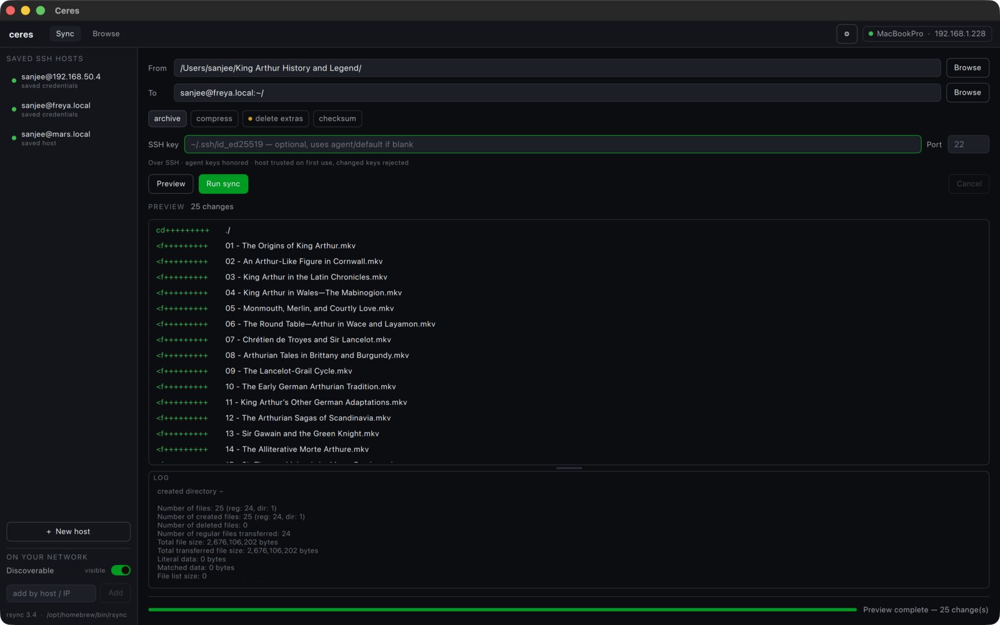
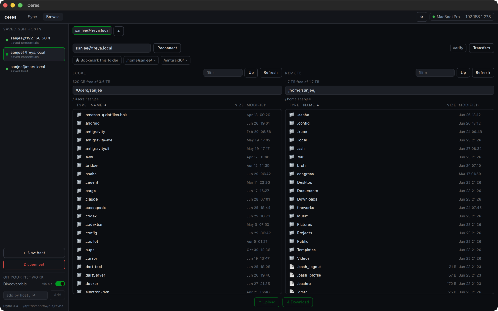

<div align="center">

# Ceres

**A sleek, cross-platform GUI for `rsync` — native C++ / Qt 6.**

[](#prerequisites)
[](https://www.qt.io/)
[](CMakeLists.txt)
[](LICENSE)
[](#status)

Ceres wraps the **real `rsync` binary** — not librsync — so it speaks the genuine
rsync wire protocol. Local, SSH (`user@host:`), and daemon (`rsync://`) targets all
just work. The aim is a calm, opinionated front-end with a real
**before-you-sync preview**, first-class live progress, and safe defaults.



</div>

## Status

> **Prototype.** Ceres boots a QML window; previews and runs ad-hoc rsync syncs through
> `QProcess`; browses local and remote files; queues parallel transfers; and streams
> parsed `--info=progress2` / `--itemize-changes` output live into the UI. The roadmap
> below tracks what's next.

## Highlights

- **🔍 Before-you-sync preview.** Every sync starts as an itemized dry-run, so you see
  exactly what would be created, updated, or deleted *before* a single byte moves.
- **🛡️ Safe by default.** A `--delete` run is gated behind a confirmation **and** a
  preview fingerprint — if the source/destination changed since you previewed, Ceres
  makes you preview again, so a stale plan can't mass-delete the wrong tree.
- **📡 Real rsync, everywhere.** Local, SSH, and daemon endpoints; delta transfer,
  resume (`--partial`), compression, and checksums all come straight from rsync.
- **📊 Live progress.** Aggregate and per-file progress stream in real time, with a
  per-file tree that stays responsive across tens of thousands of files.
- **🗂️ Dual-pane browser.** Browse local and remote (over SSH) side by side; drag work
  into the transfer queue without touching a terminal.
- **🔀 Parallel transfer queue.** A concurrency-capped queue runs independent transfers
  at once, with pause/resume and per-file progress for each.
- **🔐 Secrets in the OS keychain.** Passwords live in the macOS Keychain / libsecret /
  Windows Credential Manager — never in JSON, logs, or the exportable config bundle.
- **🕸️ LAN mesh + snapshots.** Discover peers on your network, pair trust-on-first-use,
  and take timestamped `--link-dest` snapshots you can browse on a timeline.
- **🪶 Graceful degradation.** Detects rsync's capabilities and adapts — even macOS's
  stock `openrsync` works (you just lose the live progress bar).

## Screens

### Browse — dual-pane local ⇆ remote

Browse your machine and a remote host side by side over SSH, then hand files to the
transfer queue.



### Remote folder picker

Walk a remote tree to fill in a sync source or destination — no path-typing required.


### SSH made painless

| | |
| --- | --- |
| **Password sign-in** — prompts for credentials when key auth fails, with an option to remember them in the OS keychain. |  |
| **Save SSH host** — offered the first time you use a host, so it lands in the sidebar for next time. |  |

## Architecture

```
QML (Qt Quick Controls 2, Basic)           — UI shell
  └─ JobController (QObject)               — exposed to QML
       ├─ ChangeListModel (QAbstractListModel)
       ├─ SshHostStore / SecretStore       — saved SSH hosts + OS keychain/libsecret
       ├─ DiscoveryService                 — LAN beacons
       └─ SyncEngine (abstract)            — the portability seam
            └─ RsyncProcessEngine          — QProcess + the real rsync binary
                 ├─ ArgvBuilder            — SyncJob -> argv (capability-aware)
                 ├─ OutputParser           — progress2 / itemize / stats / log
                 └─ BinaryLocator          — finds rsync, detects its capabilities
```

`ceres_core` (everything below the QML layer) is a non-GUI Qt Core/Network static
library with no Quick/QML dependency, so the parser, arg builder, and controller
behavior are unit-tested headless. A future Windows engine (cwRsync / WSL) can reuse it
behind `SyncEngine`.

See **[architecture.md](architecture.md)** for the full design: the engine/GUI split,
the process & threading model, the component map, and the key data flows (browse,
transfer queue, snapshots, mesh, config bundle).

## Prerequisites

- **Qt 6.5+** — `brew install qt`
- **CMake 3.21+** — `brew install cmake`
- **A modern GNU rsync (recommended).** macOS now ships **openrsync** (2.6.9-compatible),
  which lacks `--info=progress2` / `--outbuf` / `--no-inc-recursive`. Ceres detects this
  and degrades gracefully (you still get the itemized preview, just no live progress
  bar), but for the full experience install GNU rsync:

  ```sh
  brew install rsync   # /opt/homebrew/bin/rsync — picked up automatically
  ```

## Build & run

```sh
cmake -B build -DCMAKE_PREFIX_PATH="$(brew --prefix qt)"
cmake --build build
./build/ceres            # the GUI
```

On macOS the GUI builds as an app bundle, so run `./build/ceres.app/Contents/MacOS/ceres`
(or `open build/ceres.app`); on Linux/Windows it's `./build/ceres`.

## Test

```sh
ctest --test-dir build --output-on-failure
```

The suite covers the pieces that are easy to get subtly wrong: `OutputParser`
(itemize parsing, `\r`/`\n` chunk-boundary handling, progress2 with/without `to-chk`),
`ArgvBuilder` / `EndpointParser` (capability gating, SSH/daemon detection, quoting,
delete/dry-run, SRC/DEST placement), binary probing, path completion, discovery
beacons, the transfer-manager queue, and the controller's destructive-run gate — none
of which need a display or a live rsync/ssh, since engine and store dependencies are
injected as fakes.

## Packaging

Ceres ships with install rules and CPack configuration. The Qt runtime
(frameworks/DLLs + QML plugins) is bundled at install time, and an app icon,
`Info.plist` (macOS), and `.desktop` entry + themed icons (Linux) are included.

```sh
# Stage a self-contained install tree:
cmake --install build --prefix dist

# Or build a distributable archive locally (.dmg on macOS, NSIS .exe on Windows,
# .tar.gz on Linux):
cd build && cpack
```

**Releases** are built in CI ([`.github/workflows/release.yml`](.github/workflows/release.yml))
against an official Qt, producing portable artifacts for each platform on a `v*` tag
(or via *Run workflow*):

| Platform | Artifact | How |
|----------|----------|-----|
| macOS | `Ceres-macOS.zip` | deployed `.app`, zipped |
| Windows | `Ceres-Windows-Setup.exe` | NSIS installer |
| Linux | `Ceres-x86_64.AppImage` | `linuxdeploy` + Qt plugin |

Icons are generated from [`icons/ceres.svg`](icons/ceres.svg) into `.icns` / `.ico`
/ `.png`; regenerate with `rsvg-convert` + `iconutil` + ImageMagick if you swap the
source SVG.

> **macOS note:** a Homebrew-installed Qt uses absolute install names that
> `macdeployqt` can't fully relocate, so a *locally*-built `.dmg` runs on machines
> that have Qt but isn't byte-for-byte portable. The CI release uses an official Qt
> (`aqtinstall`) for a fully self-contained bundle. Signing/notarization is a
> separate step for public distribution.

### Windows MSYS2 rsync runtime

Ceres bundles the MSYS2 `msys` `rsync` and `openssh` packages for Windows builds.
After building on Windows with MSYS2 available at `C:\msys64` (or with `MSYS2_ROOT` /
`QT_ROOT` set), stage the testable runtime beside `ceres.exe`:

```powershell
cmake --build build --target stage-windows-runtime
```

This copies Qt DLLs/plugins/QML imports, writes `qt.conf`, and copies `rsync.exe`,
`ssh.exe`, `msys-2.0.dll`, and the DLLs reported by `ldd` into `build/rsync/bin/`,
which is one of the app-relative lookup paths.

## Roadmap

Packaging (macOS `.dmg`, Linux `.deb`/`.tar.gz`, Windows `.zip`) is in place via CPack
— see [Packaging](#packaging). Next milestones: harden the SSH/daemon flows, expand the
advanced options tier for full flag control, and sign/notarize the macOS/Linux release
artifacts for public distribution. The Windows bundled-rsync checklist lives in
[`TODO.md`](TODO.md); the full design and feature plan is in
[architecture.md](architecture.md).

## License

Ceres is free software licensed under the GNU General Public License v3.0 — see
[`LICENSE`](LICENSE). It bundles or builds on third-party components (Qt, rsync,
OpenSSH, and a Cygwin/MSYS runtime on Windows); their licenses are documented in
[`THIRD_PARTY_NOTICES.md`](THIRD_PARTY_NOTICES.md).
